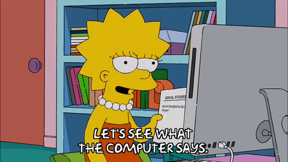

# Hi👋, I'm Mauricio
  

  

A chemical engineering student at UNICAMP with interests in software development (https://github.com/Mauri-pos).

- 🧑‍💻 Python programmer
- 🤖 Learning about artifitial neural networks
- 💻 Interest to learn new programation skills

  
  &nbsp;
  &nbsp;
  &nbsp;
  

---

